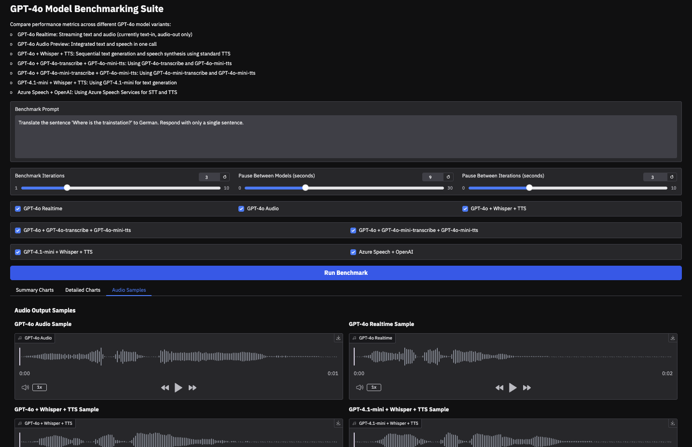
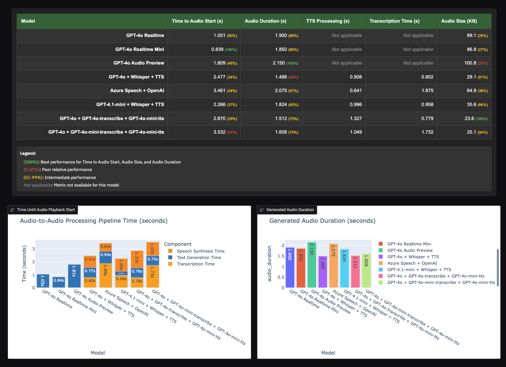

#Original repo: https://github.com/aymenfurter/gpt-4o-latency-comparison 


# GPT-4o Latency Comparison

<p align="center">
  
</p>

<p align="center">
  <a href="https://github.com/aymenfurter/gpt-4o-latency-comparison/stargazers"></a>
  <a href="https://github.com/aymenfurter/gpt-4o-latency-comparison/network/members"></a>
  <a href="https://github.com/aymenfurter/gpt-4o-latency-comparison/pulls"></a>
  <a href="https://github.com/aymenfurter/gpt-4o-latency-comparison/issues"></a>
  <a href="https://github.com/aymenfurter/gpt-4o-latency-comparison/blob/main/LICENSE"></a>
</p>

<p align="center">
  <b>Benchmarking toolkit for measuring real-world latency of GPT-4o audio implementations</b>
</p>

<p align="center">
  
</p>

## Table of Contents

* [Introduction](#introduction)
* [Key Metrics](#key-metrics)
* [Benchmark Results](#benchmark-results)
* [Installation](#installation)
* [Usage](#usage)
* [Technical Implementation](#technical-implementation)
* [Model Availability](#model-availability)
* [Acknowledgements](#acknowledgements)

## Introduction

Azure OpenAI Service now offers multiple ways to implement GPT-4o with audio capabilities:

* **GPT-4o Realtime** - Streaming text and audio responses with minimal latency
* **GPT-4o Realtime Mini** - Lighter variant of realtime model
* **GPT-4o Audio Preview** - Integrated text and speech in a single API call
* **Azure Speech + OpenAI** - Using Azure Speech Services for speech-to-text and text-to-speech
* **GPT-4o + GPT-4o-transcribe + GPT-4o-mini-tts** - Sequential processing with transcription and mini-tts
* **GPT-4o + GPT-4o-mini-transcribe + GPT-4o-mini-tts** - Using smaller transcribe model
* **GPT-4.1-mini + Whisper + TTS** - Alternative implementation based on GPT-4.1-mini model

Each implementation offers different tradeoffs between **latency**, **audio quality**, and **implementation complexity**. This toolkit helps you quantify these differences to choose the best option for your specific use case.

## Key Metrics

This benchmarking suite captures critical metrics across all GPT-4o audio implementations:

| Metric                     | Description                                        | Why It Matters                                          |
| -------------------------- | -------------------------------------------------- | ------------------------------------------------------- |
| **Time to Audio Playback** | How long until the first audio would begin playing | Critical for real-time applications and user experience |
| **Audio Duration**         | Length of the generated audio in seconds           | Indicates speech rate and information density           |

## Benchmark Results

The Benchmark results vary dramatically based on the input prompt used. Here is a sample result for the provided default prompt:

<p align="center">
  
</p>

Our interactive Gradio interface allows you to:

* Compare multiple models side-by-side
* Run multi-iteration benchmarks for statistical reliability
* Visualize performance differences with detailed charts
* Listen to audio samples to evaluate quality differences

## Installation

1. Clone the repository:

```bash
git clone https://github.com/aymenfurter/gpt-4o-latency-comparison.git
cd gpt-4o-latency-comparison
```

2. Install dependencies:

```bash
pip install -r requirements.txt
```

3. Install FFmpeg (required for audio duration detection):

```bash
# For Debian/Ubuntu
apt-get update && apt-get install -y ffmpeg

# For macOS
brew install ffmpeg

# For Windows
# Download from https://ffmpeg.org/download.html
```

4. Create a `.env` file with your Azure OpenAI credentials:

```
AZURE_OPENAI_ENDPOINT=https://your-endpoint.openai.azure.com/
AZURE_OPENAI_API_KEY=your-api-key-here
AZURE_OPENAI_API_VERSION=2025-01-01-preview
GPT4O_DEPLOYMENT=your-gpt4o-deployment-name
GPT4O_REALTIME_DEPLOYMENT=your-gpt4o-realtime-preview-deployment-name
GPT4O_AUDIO_DEPLOYMENT=your-gpt4o-audio-preview-deployment-name
TTS_DEPLOYMENT=your-tts-deployment-name
BENCHMARK_PAUSE_TIME=0  # Set the pause time between model tests (in seconds)
```

## Usage

1. Start the benchmarking interface:

```bash
python app.py
```

2. Open the URL displayed in the console (typically [http://127.0.0.1:7860](http://127.0.0.1:7860))

3. Enter a prompt, select the desired models, set the number of iterations, and configure the pause time between tests

4. Click "Run Benchmark" to start the comparison

## Technical Implementation

This toolkit uses a structured benchmarking approach:

1. **Isolation**: Each model is tested independently to prevent interference
2. **Multiple Iterations**: Running repeated tests reduces the impact of network/service variability
3. **Comparable Metrics**: All models measure the same core performance indicators
4. **Audio Analysis**: FFmpeg and pydub are used for detailed audio file analysis

The benchmarking is performed through these key components:

* `benchmark_runner.py` - Orchestrates the testing process
* `models/` - Implementation classes for each GPT-4o variant
* `utils/` - Helper functions for metrics collection and analysis
* `app.py` - Gradio interface for interactive testing

## Model Availability (As per 09.05.2025)

| **Model**                 | **Service**     | **Availability** | **Reference**                                                                                                                           |
| ------------------------- | --------------- | ---------------- | --------------------------------------------------------------------------------------------------------------------------------------- |
| `gpt-4o`                  | Azure OpenAI    | ✅ GA            | [link](https://learn.microsoft.com/en-us/azure/ai-services/openai/concepts/models)                                                      |
| Whisper                   | Azure OpenAI    | ✅ GA            | [link](https://azure.microsoft.com/en-us/blog/accelerate-your-productivity-with-the-whisper-model-in-azure-ai-now-generally-available/) |
| Real-time speech to text  | Azure AI Speech | ✅ GA            | [link](https://learn.microsoft.com/en-us/azure/ai-services/speech-service/speech-to-text)                                               |
| Text to speech            | Azure AI Speech | ✅ GA            | [link](https://learn.microsoft.com/en-us/azure/ai-services/speech-service/text-to-speech)                                               |
| `gpt-4.1-mini`            | Azure OpenAI    | 🧪 Preview (API) | [link](https://azure.microsoft.com/en-us/blog/announcing-the-gpt-4-1-model-series-for-azure-ai-foundry-developers/)                     |
| `gpt-4o-realtime-preview` | Azure OpenAI    | 🧪 Preview       | [link](https://learn.microsoft.com/en-us/azure/ai-services/openai/realtime-audio-quickstart)                                            |
| `gpt-4o-audio-preview`    | Azure OpenAI    | 🧪 Preview       | [link](https://learn.microsoft.com/en-us/azure/ai-services/openai/audio-completions-quickstart)                                         |
| `gpt-4o-transcribe`       | Azure OpenAI    | 🧪 Preview       | [link](https://learn.microsoft.com/en-us/azure/ai-services/openai/concepts/models)                                                      |
| `gpt-4o-mini-transcribe`  | Azure OpenAI    | 🧪 Preview       | [link](https://learn.microsoft.com/en-us/azure/ai-services/openai/concepts/models)                                                      |
| `gpt-4o-mini-tts`         | Azure OpenAI    | 🧪 Preview       | [link](https://learn.microsoft.com/en-us/azure/ai-services/openai/concepts/models)                                                      |
| `tts`                     | Azure OpenAI    | 🧪 Preview       | [link](https://learn.microsoft.com/en-us/azure/ai-services/openai/text-to-speech-quickstart)                                            |
| `tts-hd`                  | Azure OpenAI    | 🧪 Preview       | [link](https://learn.microsoft.com/en-us/azure/ai-services/openai/text-to-speech-quickstart)                                            |

## Acknowledgements

* [OpenAI](https://openai.com/) and [Microsoft Azure](https://azure.microsoft.com/) for providing the GPT-4o APIs
* [Gradio](https://gradio.app/) for the interactive interface components
* [FFmpeg](https://ffmpeg.org/) for audio analysis capabilities
